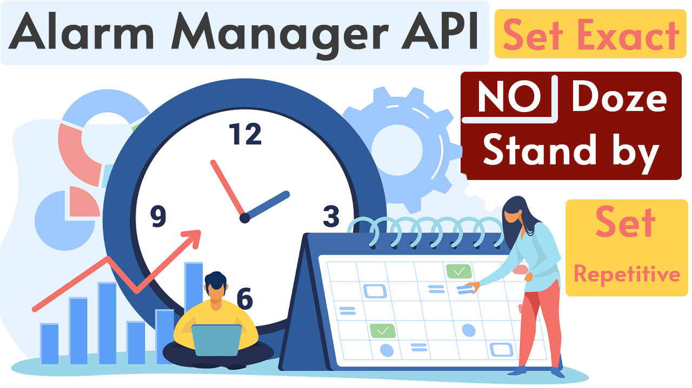

<p align="center">
  <a href="https://img.shields.io/badge/License-MIT-yellow.svg"></a>
  <a href="https://badges.frapsoft.com/os/v2/open-source.svg?v=103"></a>
</p>



# set_repetitive_exact_alarm
This project is about how to use the Alarm Manager API to set Exact alarms irrespective of doze or standby modes provided by the framework. You can execute your tasks at the given particular time.
In the demo at the exact time, the notification will be built through the Alarm Receiver. I have also shown how to use the set Exact method as a repetitive alarm because the default setRepetitive alarm doesn't trigger in the given time so this logic will help you out to perform repetitive tasks in a nice way.

## License
```
MIT License

Copyright (c) 2020 Sri Harsha Pothineni

Permission is hereby granted, free of charge, to any person obtaining a copy
of this software and associated documentation files (the "Software"), to deal
in the Software without restriction, including without limitation the rights
to use, copy, modify, merge, publish, distribute, sublicense, and/or sell
copies of the Software, and to permit persons to whom the Software is
furnished to do so, subject to the following conditions:

The above copyright notice and this permission notice shall be included in all
copies or substantial portions of the Software.

THE SOFTWARE IS PROVIDED "AS IS", WITHOUT WARRANTY OF ANY KIND, EXPRESS OR
IMPLIED, INCLUDING BUT NOT LIMITED TO THE WARRANTIES OF MERCHANTABILITY,
FITNESS FOR A PARTICULAR PURPOSE AND NONINFRINGEMENT. IN NO EVENT SHALL THE
AUTHORS OR COPYRIGHT HOLDERS BE LIABLE FOR ANY CLAIM, DAMAGES OR OTHER
LIABILITY, WHETHER IN AN ACTION OF CONTRACT, TORT OR OTHERWISE, ARISING FROM,
OUT OF OR IN CONNECTION WITH THE SOFTWARE OR THE USE OR OTHER DEALINGS IN THE
SOFTWARE.
```
